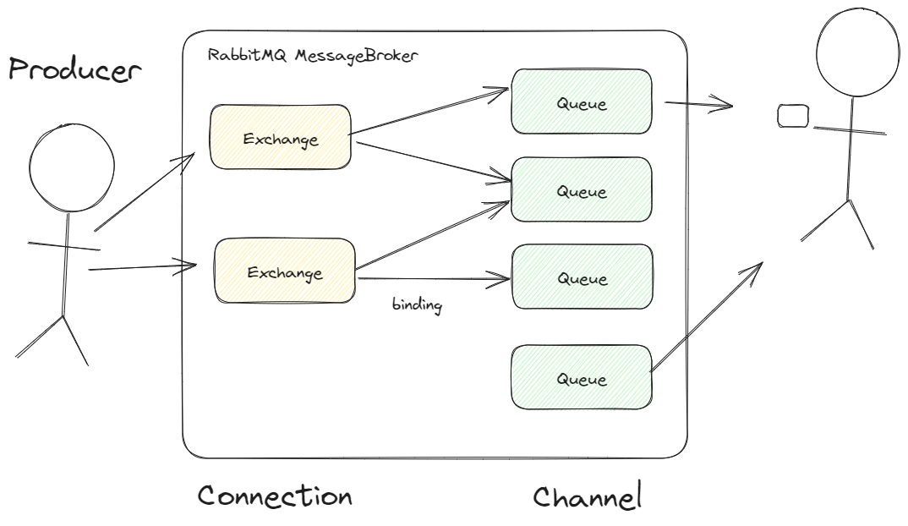
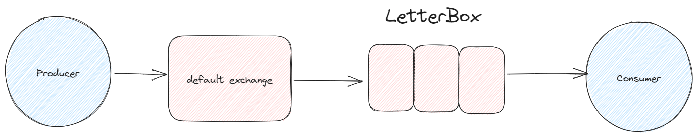

# rabbitmq-simple-example
Imagine que uma pessoa quer mandar uma carta para outra, mas nao necessariamente ficamos o dia todo no correio esperando saber se a carta vai chegar ou nao pra pessoa, simplesmente confiamos
que o fornecedor vai chegar com a mensagem para o destinario.
As Exchanges faz o papel deste funcionarios do correios onde podem ter varias filas(Queues) onde postamos nossas carta como (Producer) para nosso destinatario (Consumer) ler a nossa mensagem.


Para entender o conceito de Brokers como RabbitMQ (mensageria), sempre temos um Produtor e Consumidor (Como a imagem abaixo).



Dentro da pasta de Producer temos um app console baseado em .Net que dentro da exchange e na queue letterbox vamos postar a mensagem de "Hello world"

```C#
channel.QueueDeclare(queue: "letterbox", durable:false, exclusive:false, autoDelete:false, arguments:null);
var message = "Hello World";
```

E no consumer bem simples temos somente o evento EventingBasicConsumer, onde apos receber a msg vai mostrar no terminal

```C#
var consumer = new EventingBasicConsumer(channel);

consumer.Received += (model, ea) => {
    var body = ea.Body.ToArray();
    var message = Encoding.UTF8.GetString(body);
    Console.WriteLine($"Messages Received: {message}");
};

channel.BasicConsume(queue: "letterbox", autoAck: true, consumer: consumer);
```
